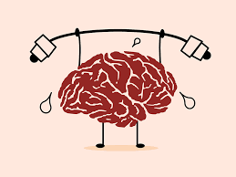

```{r setup, include=FALSE}
knitr::opts_chunk$set(echo = TRUE)
```



## Introduction

Here at **IQ BOSS®**, we care about the impact our products have on our customers. That is why we employ the highest of scientific rigour and ethical proceedures in demonostrating the effectiveness of our products. This report was generated to demonstrate the efficacy of the _IQBoss: Brain Boost™_ pill.

## General review of alternatives

Neurotropics are supplements that improve cognitive function, particularly executive functions, memory, creativity, or motivation, in healthy individuals [@schindler1984]. While many substances are purported to improve cognition, research is at a preliminary stage for the majority of these agents. Here we take a step ahead of competitors and demonstrate the impact of our blend of neurotropics.

Systematic reviews and meta-analyses of clinical human research using low doses of certain central nervous system stimulants found enhanced cognition in healthy people [@spencer2015]. In particular, the classes of stimulants that demonstrate cognition-enhancing effects in humans act as direct agonists or indirect agonists of dopamine receptor D1, adrenoceptor A2, or both types of receptor in the prefrontal cortex.

## Brain Boost details

_IQBoss: Brain Boost™_ is an advanced neurotropic developed using the highest grade material and available for sale at local pharmacy stores. _Brain Boost™_ is developed from a mixture of L-Theanine, Methylphenidate, Vitamin D, Acetyl L-Carnitine, and overall Vitamin Complex (see [our website](http://www.brainboss.com/brainboost/ingredients) for more information). These are known to impact grey matter volume and prefrontal cortical activity (a central area for executive functions and human intelligence) [@haier2004].

Here we demonstrate the impact using different dosages of our _Brain Boost™_ pill. Standard dosage is 0.14 fluid oz of active ingredients.

## Experimental design

We ran two independent studies at different locals (New York, USA and York, England), recruiting locally available participants through an online campaign. Participants were paid for their participation following standard ethical protocol.

Participants went through a battery of cognitive testing, including standard IQ tests, as well as collected demographic data. The demographic and cognitive tests were used to determine initial population characteristics and balance treatment regimes.

## Results

```{r loading, include=FALSE}

library(tidyverse)
library(knitr)
library(ggplot2)
library(broom)
library(devtools)

load("datasets/clean_data/Dataset05112016_cleaned.Rdata")
exp1 <- data %>%
  mutate(IQ_change = IQ_post - IQ_pre)
load("datasets/clean_data/Dataset08082018_cleaned.Rdata")
exp2 <- data %>%
  mutate(IQ_change = IQ_post - IQ_pre) %>%
  mutate(dose_ml = dose_l / 100)
```

For experiment 1 we collected `r dim(exp1)[1]` subjects (mean age = `r round(mean(exp1$age, na.rm=TRUE))`) and for experiment 2 we collected `r dim(exp2)[2]` subjects  (mean age = `r round(mean(exp2$age, na.rm=TRUE))`).

For both experiments we demonstrate results using a standard linear model, fit with the 'lm' function using R. Our design is:

$$
IQ_{post-pre} = \beta_1 \ dosage_{ml} + \beta_0 + \epsilon
$$
Allowing us to interpret $$\beta_1$$ as the impact of dosage on IQ change.

### Experimental 1 results:

Figure results are displayed below. Plotted is the linear regression best fit line along with standard error.


```{r exp1, echo=FALSE, fig.height=3, fig.width=5, fig.align="center"}

ggplot(exp1, aes(dose_ml, IQ_change)) +
  geom_point() +
  geom_smooth(method = lm) +
  xlab("Administered Dosage (ml)") +
  ylab("IQ change") #+
 # ggtitle("Experiment 1 results: impact of pill dosage on IQ")
```

Predictive model results are displayed below.

```{r exp1lm, echo=FALSE}

lm_model <- lm(formula = IQ_change ~ dose_ml, data = exp1)

kable(tidy(lm_model), digits = 3)

```

### Experimental 2 results:

Figure results are displayed below. Plotted is the linear regression best fit line along with standard error.

```{r exp2, echo=FALSE, fig.height=3, fig.width=5, fig.align="center"}

ggplot(exp2, aes(dose_ml, IQ_change)) +
  geom_point() +
  geom_smooth(method = lm) +
  xlab("Administered Dosage (ml)") +
  ylab("IQ change") 

```

Predictive model results are displayed below.

```{r exp2lm, echo=FALSE}
lm_model <- lm(formula = IQ_change ~ dose_ml, data = exp2)

kable(tidy(lm_model), digits = 3)
```

## Conclusion

As demonstrated in two experiments, both results show a significant impact of dosage on intelligence gain over a period of 3 months. 

This supports the impact and efficacy of the _IQBoss: Brain Boost™_ pill, and demonstrates its safety and importance to our customer base.

## References
